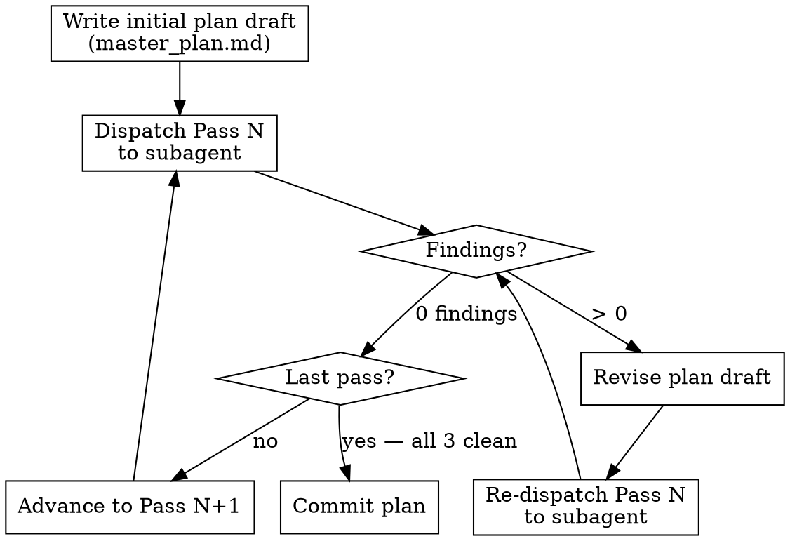

# feature-3-plan

**Announce:** "Using feature-3-plan to run architectural review and create the implementation plan."

## Overview

Writes `master_plan.md`, runs 3 mandatory subagent-dispatched review passes until all converge to 0 findings, then commits. See `plan-templates.md` in this skill directory for all section requirements, copy-paste templates, the pre-commit checklist, and commit instructions.

## Pre-Promotion Checklist

Before starting, verify in `needs_refinement/FEATURE-NAME.md`:
1. All Open Questions have owner + status (resolved or tracked)
2. Size is specified
3. Problem Statement is complete
4. At least one Acceptance Criterion is defined

## Workflow

1. Write initial `master_plan.md` draft using templates from `plan-templates.md`
2. Run all 3 review passes (see below)
3. Verify pre-commit checklist in `plan-templates.md`
4. Commit using instructions in `plan-templates.md`

## Plan Review Passes (Mandatory, Sequential, Subagent-Dispatched)

**Core rule:** Each review pass MUST be dispatched to a **separate subagent** (Agent tool, `subagent_type: general-purpose`). You may NOT perform these reviews inline. Subagent dispatch is the enforcement mechanism — it prevents you from shortcutting the review.

A pass is "clean" only when the subagent reports **0 findings**. If findings > 0: revise the plan draft, then re-dispatch the SAME pass. Only advance to the next pass after the current one is clean.



### Pass 1: Domain Skills Review

Dispatch subagent to:
- Read the plan draft (provide full plan text in prompt)
- Invoke applicable domain skills: Rust → `rust-skills`; Frontend → `vercel-react-best-practices` + `vercel-composition-patterns` + `frontend-design`
- Review the plan against each loaded skill for performance, composition, API design, and pattern issues

### Pass 2: Decomposition & Codebase Consistency Review

Dispatch subagent to:
- Read the plan draft
- **Explore actual source code** in directories the plan touches (use Glob/Grep/Read — not just docs)
- Compare proposed patterns, component structure, state management, and file organization against **existing codebase conventions**
- Check for: separation of concerns violations, unnecessary novelty vs existing patterns, missed reuse opportunities, single-responsibility violations, type/module domain boundary correctness, data flow implications

**Why this pass matters:** Domain skills (Pass 1) give good generic advice that may conflict with this specific codebase's conventions. Pass 2 catches those conflicts.

### Pass 3: Architecture, Boundary & Goal Alignment Review

Dispatch subagent to:
- Read the plan draft
- Re-read `docs/strategy/` architecture docs and `docs/strategy/goals.md`
- Re-read relevant crate/module `AGENTS.md` files
- Verify: proposed changes respect crate/module boundaries and dependency directions; no conflicts with existing architecture decisions; Goal IDs map accurately to work items; no goals are undermined

### Subagent Requirements

Each review pass subagent prompt MUST include:
1. The **full plan text** (not a summary)
2. The **specific pass instructions** from the corresponding section above
3. The **required output format** below
4. For Pass 2: the **directory paths** the plan touches

If a subagent times out, that is a failed pass — re-dispatch it.

### Required Subagent Output Format

Include this in every review pass subagent prompt:
```
Return your review in this exact format:

## Findings
1. [HIGH/MEDIUM/LOW] Description of finding and recommended fix
2. [HIGH/MEDIUM/LOW] ...

**Total: N findings**

If no issues found, return:

## Findings
(none)

**Total: 0 findings**
```

### Review Audit Trail

After each pass converges, append the subagent's final output to `FEATURE-NAME/review_log.md`:

```markdown
## Pass N: [Pass Name] — Dispatch M
[paste subagent's Findings output here]
```

If `review_log.md` does not exist or is missing passes, the review was not completed.

Record total subagent dispatches: `**Review cycles:** N` in `master_plan.md`.
