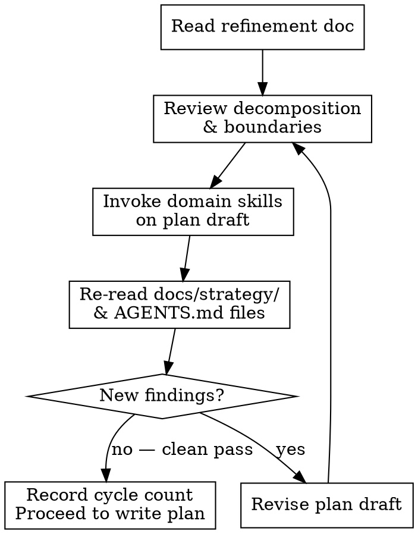

# feature-3-plan

**Announce:** "Using feature-3-plan to run architectural review and create the implementation plan."

## Overview

Runs a mandatory recursive architectural decomposition review, then creates `docs/features/ready_to_implement/FEATURE-NAME/master_plan.md` satisfying the full plan-harness schema. The plan MUST include review gate checkmarks as explicit steps.

## Pre-Promotion Checklist

Before starting the review cycle, verify:
1. All Open Questions in `needs_refinement/FEATURE-NAME.md` have owner + status (resolved or tracked)
2. Size is specified
3. Problem Statement is complete
4. At least one User Story / Acceptance Criterion is defined

## Architectural Decomposition Review (Mandatory, Recursive)

This review MUST happen during planning — not deferred to implementation.



### Review Checklist (all mandatory)

1. **Decomposition:** Review for separation of concerns, single-responsibility violations, and opportunities to split work into smaller units.
2. **Boundary check:** Verify proposed changes respect existing crate/module boundaries and dependency directions.
3. **Domain skill review:**
   - **REQUIRED SUB-SKILL:** Rust/backend in scope → invoke `rust-skills`, review plan against it
   - **REQUIRED SUB-SKILL:** Frontend in scope → invoke `vercel-react-best-practices` + `vercel-composition-patterns`, review
   - Incorporate findings into plan scope or Open Questions
4. **Architecture docs:** Re-read `docs/strategy/` architecture docs and relevant crate/module `AGENTS.md` files. Verify no conflicts with existing boundaries, dependency directions, or module responsibilities.
5. **Goal alignment:** Re-read `docs/strategy/goals.md` and verify Goal IDs map accurately.
6. **Repeat** from step 1 until a clean pass (no new findings).

Record: `**Review cycles:** N` in `master_plan.md`.

## master_plan.md Creation

Create `docs/features/ready_to_implement/FEATURE-NAME/master_plan.md` with:

### Required Metadata Lines
```markdown
**Goal:** [one-line goal statement]
**Goal IDs:** GP-XX, GO-XX (from docs/strategy/goals.md)
**Scope:** [what's in/out]
**Docs Impact:** [canonical docs touched]
**Supersedes:** [prior plans this replaces, or "none"]
**Superseded-By:** [none]
```

### Required Sections
- `## Goal Alignment` — maps each Goal ID to specific work items
- `## Boundary Impact` — what crate/module boundaries change
- `## Existing Boundary Recheck` — table: `| Area | Decision | Rationale |` (≥2 rows, decision = keep/change)
- `## Open Questions` — table: `| Question | Decision | Owner | Status |` (≥1 row, all resolved)
- `## Required Skills` — domain skills to invoke (see template below)
- `## TDD Policy` — see template below
- `## Code Review Policy` — see template below
- `## Commit Policy` — see template below
- `## Implementation Steps` — `- [ ]` checkmark format with **mandatory review gate checkmarks** (see below)

### Required Skills Section Template
```markdown
## Required Skills
- Rust/backend changes: invoke `rust-skills` BEFORE writing any Rust code and before each review
- Frontend changes: invoke `vercel-react-best-practices` and `vercel-composition-patterns`
  BEFORE writing any frontend code and before each review
- Frontend UI/design: invoke `web-design-guidelines` and `frontend-design` BEFORE writing any UI
  code; use `agent-browser` for screenshot-based design validation after each step
```
(Include only the lines applicable to this feature's scope.)

### TDD Policy Section Template
```markdown
## TDD Policy
For all behavior changes and bug fixes: write a failing test FIRST, then implement.
A step is not complete until:
1. The failing test exists and is committed
2. The implementation makes it pass
3. No existing tests regress

Frontend: e2e tests using `agent-browser` MUST be written per user-facing step.
Frontend UI changes: use `agent-browser` screenshots + `web-design-guidelines` review after each step.
Repeat screenshot + review until clean (recursive).
```

### Code Review Policy Section Template
```markdown
## Code Review Policy
After completing each implementation step:
1. Run a thorough code review (backend: `rust-skills`; frontend: vercel skills)
2. Fix ALL findings
3. Run review AGAIN — repeat until no new findings (clean recursive pass)
4. Only after clean pass: commit the step
```

### Commit Policy Section Template
```markdown
## Commit Policy
- Commits happen AFTER a clean code review pass, never before
- One commit per implementation step (focused, atomic)
- Do NOT advance to the next step until current step is committed and reviewed clean
```

### Implementation Steps Format — WITH MANDATORY REVIEW GATES

**CRITICAL:** Every plan MUST include review gate checkmarks as `- [ ]` items within `## Implementation Steps`. These are not optional. The plan harness validates their presence.

```markdown
## Implementation Steps
- [ ] Step 1: ...
- [ ] Step 2: ...
- [ ] Step N: ... (last implementation step)
- [ ] Review Gate: Code review — dispatch `superpowers:code-reviewer` subagent on full branch diff. Invoke domain skills (backend: `rust-skills`; frontend: `vercel-react-best-practices` + `vercel-composition-patterns`). Fix all findings. Re-review until clean pass.
- [ ] Review Gate: Architecture & decomposition review — review all changes for boundary violations, decomposition opportunities, separation of concerns. Re-read `docs/strategy/` and relevant `AGENTS.md` files. Fix easy issues, capture larger items in `docs/features/brainstorms/ideas.md`. Repeat until clean pass.
- [ ] Completion gate — run all checks from AGENTS.md Completion Gate section
```

**Agents follow checkmarks. If it is not a checkmark, it will be skipped.** This is why review gates MUST be checkmarks, not prose policies.

For large features (6+ implementation steps), add an **interim review gate** after every 3-4 steps:
```markdown
- [ ] Step 1: ...
- [ ] Step 2: ...
- [ ] Step 3: ...
- [ ] Review Gate: Interim code review — review Steps 1-3 changes. Fix findings, re-review until clean.
- [ ] Step 4: ...
- [ ] Step 5: ...
- [ ] Step 6: ...
- [ ] Review Gate: Code review — full branch diff review (see above)
- [ ] Review Gate: Architecture & decomposition review (see above)
- [ ] Completion gate — run all AGENTS.md completion checks
```

## Plan Splitting Rule

If `master_plan.md` exceeds ~500 lines or covers more than one major area, split into companion files:
- Companion naming: `FEATURE-NAME-TOPIC.md` (e.g., `storage-slots-server.md`)
- `master_plan.md` must include `**See also:**` links to each companion
- Each companion must include a `**Parent plan:**` back-reference to `master_plan.md`
- Each file (main and companion) must independently satisfy required metadata and structure rules

## Enforcement Checklist

Before writing the file, verify the draft enforces:
- [ ] `rust-skills` reference if any Rust/backend changes in scope
- [ ] `vercel-react-best-practices` / `vercel-composition-patterns` if any frontend in scope
- [ ] `frontend-design` + `web-design-guidelines` if any UI/design changes in scope
- [ ] `agent-browser` for e2e tests per frontend step (not as afterthought)
- [ ] `superpowers:using-git-worktrees` mentioned in implementation setup
- [ ] `## TDD Policy` section present
- [ ] `## Required Skills` section present
- [ ] `## Code Review Policy` with recursive gate
- [ ] `## Commit Policy`
- [ ] Implementation Steps use `- [ ]` format
- [ ] **Review Gate checkmarks present in Implementation Steps** (code review + architecture review)
- [ ] Interim review gates added for features with 6+ steps
- [ ] `**Review cycles:** N` at bottom

## Final Action — Commit All Planning Artifacts

1. **Archive the refinement doc** into the plan directory so it travels with the feature through the lifecycle:

```bash
mv docs/features/needs_refinement/FEATURE-NAME.md docs/features/ready_to_implement/FEATURE-NAME/refinement.md

# Maintain .gitkeep so empty directory stays tracked
[ -z "$(ls -A docs/features/needs_refinement/ 2>/dev/null)" ] && touch docs/features/needs_refinement/.gitkeep
```

2. **Commit ALL artifacts** created during planning on the current branch:

```bash
git add docs/features/ready_to_implement/FEATURE-NAME/
git add docs/features/needs_refinement/
git add docs/features/brainstorms/ideas.md  # if modified
git commit -m "plan: FEATURE-NAME — architectural review and implementation plan"
```

**This commit is mandatory.** `feature-4-implement` creates a worktree from HEAD. If planning artifacts are uncommitted, they will not exist in the worktree and the implementation workflow will break.
