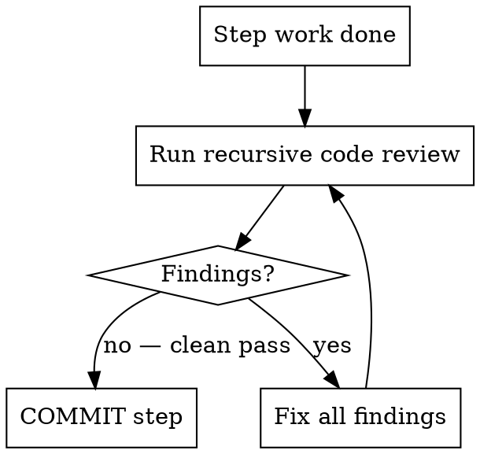

# feature-4-implement

**Announce:** "Using feature-4-implement to begin implementing FEATURE-NAME."

## Overview

Validates the plan, moves the feature to `in_progress/`, sets up execution context, dispatches parallel agents where possible, and begins from the first unchecked step.

## Pre-Implementation Checklist

1. **Planning artifacts are committed** on the current branch (verify with `git status` — if `ready_to_implement/FEATURE-NAME/` has uncommitted changes, commit them first)
2. `scripts/check-plan-harness.sh --mode strict` passes against `master_plan.md`
3. `master_plan.md` has an `## Implementation Steps` section with `- [ ]` checkmark items
4. **REQUIRED SUB-SKILL:** Worktree created via `superpowers:using-git-worktrees`

If any check fails, resolve it before proceeding.

## Move to In-Progress

```bash
mv docs/features/ready_to_implement/FEATURE-NAME/ docs/features/in_progress/FEATURE-NAME/

# Maintain .gitkeep so empty directory stays tracked
[ -z "$(ls -A docs/features/ready_to_implement/ 2>/dev/null)" ] && touch docs/features/ready_to_implement/.gitkeep
git add docs/features/ready_to_implement/ docs/features/in_progress/FEATURE-NAME/
git commit -m "chore: move FEATURE-NAME to in_progress"
```

## The Commit Gate (Mandatory for Every Step)



**Every implementation step MUST pass through this gate before committing. No exceptions.**

### The Gate

After completing a step's work, STOP. Before committing:

1. Run a **recursive code review** using domain skills:
   - Backend: invoke `rust-skills`, review all changes in the step
   - Frontend: invoke `vercel-react-best-practices` + `vercel-composition-patterns`
2. Fix ALL findings
3. Run the review AGAIN
4. Repeat until clean pass (no new findings)
5. Only THEN commit the step

**Do NOT advance to the next step until the current step is committed and reviewed clean.**

### Red Flags — STOP and Re-Read This Section

If you catch yourself thinking any of these, STOP:

| Thought | Reality |
|---------|---------|
| "This change is too small to review" | Small changes break things. Review it. |
| "I already checked while writing" | Writing-time review is not the formal post-step review. Run it. |
| "I'll review after committing" | The gate is BEFORE commit. Re-read the flowchart. |
| "I'll batch-review multiple steps" | Per-STEP review. Not per-batch. Not per-feature. Per-step. |
| "The tests pass so it's fine" | Tests passing does not mean reviewed. Code review catches what tests don't. |
| "Let me just commit this and move on" | This is the #1 rationalization. STOP. Run the review. |
| "I already completed multiple steps without reviewing" | Do NOT batch-commit. Review each step's diff separately, commit each individually. |

## Execution Policies

### Checkmarks
Update `master_plan.md` as each step completes: change `- [ ]` to `- [x]`. Commit the checkmark update together with the step's work.

### TDD
For all behavior changes and bug fixes: write the failing test FIRST. Do not implement before the test exists and fails for the right reason.

### Frontend Design Validation
For any step that adds or changes UI:
1. Use `agent-browser` to take screenshots
2. Review against `web-design-guidelines` and `frontend-design` principles
3. Fix any issues; repeat until clean

### Domain Skills
Invoke the skills declared in `## Required Skills` of `master_plan.md` BEFORE writing code in each domain. Do not skip this even for "small" changes.

## Parallel Dispatch

Review `## Implementation Steps` for independence. If 2+ steps have `[parallel]` tag and no shared state or sequential dependencies:
- **REQUIRED SUB-SKILL:** Use `superpowers:dispatching-parallel-agents` to execute them in parallel
- For sequential independent groups: **REQUIRED SUB-SKILL:** Use `superpowers:subagent-driven-development`

## Begin Execution

Start from the first unchecked `- [ ]` step in `master_plan.md`.

**Remember: every step goes through the Commit Gate before committing.**
