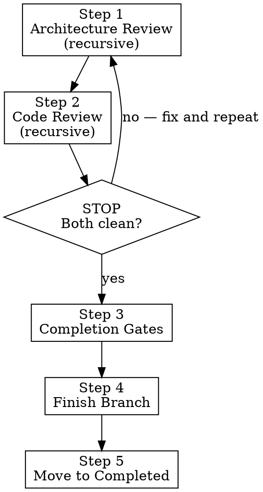

# feature-6-complete

**Announce:** "Using feature-6-complete to run final gates and close out FEATURE-NAME."

## Overview

Five mandatory steps in order. Do not skip or reorder.



## Step 1: Post-Implementation Architecture Review (Recursive, Mandatory)

Review the completed implementation holistically. Repeat until clean pass.

1. Review for decomposition opportunities, separation of concerns, and domain boundary issues uncovered during implementation.
2. Re-read `docs/strategy/` architecture docs and relevant crate/module `AGENTS.md` files. Verify no conflicts with existing boundaries.
3. **Easy fixes** (cosmetic, obvious): fix immediately and commit.
4. **Larger enhancements or refactors**: add each as a new entry in `docs/features/brainstorms/ideas.md` with context ("uncovered during FEATURE-NAME implementation").
5. Repeat from step 1 until a clean pass (no new decomposition/boundary findings).

## Step 2: Final Code Review (Recursive, Mandatory)

**REQUIRED SUB-SKILL:** Run code review via `superpowers:requesting-code-review`.

This is a FULL recursive code review of the entire feature branch diff (holistic, not per-step):

1. Review all changes against domain skills (backend: `rust-skills`; frontend: `vercel-react-best-practices` + `vercel-composition-patterns`)
2. Fix ALL findings
3. Run review AGAIN — repeat until clean pass (no new findings)
4. Commit any fixes

**STOP. Do NOT proceed to Step 3 until Steps 1 and 2 are both clean.**

## Step 3: Completion Gate (Full AGENTS.md Gate)

Before running gates, confirm: "Step 1 architecture review produced a clean pass. Step 2 code review produced a clean pass." If you cannot confirm both, go back and do them.

Run ALL of the following and confirm they pass:

```bash
scripts/check-plan-harness.sh --mode strict
scripts/check-doc-harness.sh --mode strict
scripts/check-architecture-harness.sh --mode strict
cd v3 && cargo fmt --all -- --check
cd v3 && cargo test --workspace
cd v3 && cargo clippy --workspace --all-targets -- -D warnings
```

If frontend changes were made: confirm all `agent-browser` e2e tests pass.

**REQUIRED SUB-SKILL:** Use `superpowers:verification-before-completion` — confirm all gate output before claiming completion.

**Do not proceed until all gates pass with confirmed output.**

## Step 4: Finish Development Branch

**REQUIRED SUB-SKILL:** Use `superpowers:finishing-a-development-branch` to handle merge, PR creation, and worktree cleanup.

## Step 5: Move to Completed

After the worktree is merged and closed (you are now on main):

```bash
# Move feature to completed
mv docs/features/in_progress/FEATURE-NAME/ docs/features/completed/FEATURE-NAME/

# Archive refinement doc with the feature (if it exists)
[ -f docs/features/needs_refinement/FEATURE-NAME.md ] && \
  mv docs/features/needs_refinement/FEATURE-NAME.md docs/features/completed/FEATURE-NAME/refinement.md

# Maintain .gitkeep in directories that may now be empty
for dir in docs/features/in_progress docs/features/needs_refinement; do
  [ -z "$(ls -A "$dir" 2>/dev/null)" ] && touch "$dir/.gitkeep"
done

git add docs/features/completed/FEATURE-NAME/ docs/features/in_progress/ docs/features/needs_refinement/
git commit -m "feat: mark FEATURE-NAME as completed"
```

## Red Flags — STOP and Re-Read Steps 1-2

If you catch yourself thinking any of these, you are about to skip a mandatory review:

| Thought | Reality |
|---------|---------|
| "Gates passed, we're done" | Gates are Step 3. Reviews are Steps 1-2. Did you do them FIRST? |
| "The per-step reviews already caught everything" | Per-step reviews catch step-level issues. Holistic review catches cross-step issues. |
| "Let me just merge and clean up" | Merge is Step 4. Steps 1-3 come first. Follow the numbers. |
| "Architecture review was done during planning" | Planning review was pre-implementation. This is POST-implementation. Different code exists now. |
| "I'll do a quick scan" | "Quick scan" is not a recursive review. Run domain skills. Document findings. Repeat until clean. |
| "I can skip straight to the gates" | Steps 1-2 exist because they catch things gates don't. Do them. |
