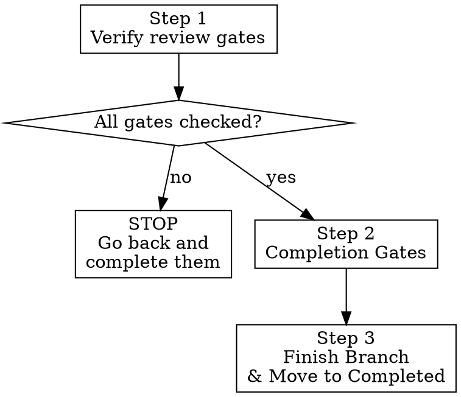

# feature-6-complete

**Announce:** "Using feature-6-complete to run final gates and close out FEATURE-NAME."

## Overview

Three mandatory steps in order. Do not skip or reorder.



## Step 1: Verify Review Gates Were Completed

**Before anything else**, read `master_plan.md` and verify:

1. ALL `Review Gate:` checkmarks are `- [x]` (checked off)
2. If ANY review gate is unchecked (`- [ ]`): **STOP. Go back to `feature-4-implement` and complete them.** Do not proceed.

If the plan has no review gate checkmarks at all (legacy plan created before this policy), you MUST run them now:
1. **Code review:** Dispatch `superpowers:code-reviewer` subagent on full branch diff. Invoke domain skills. Fix all findings, re-review until clean pass.
2. **Architecture & decomposition review:** Review all changes for boundary violations, decomposition opportunities, separation of concerns. Re-read `docs/strategy/` and relevant `AGENTS.md` files. Fix easy issues, capture larger items in `docs/features/brainstorms/ideas.md`. Repeat until clean pass.
3. Check them off in `master_plan.md` and commit.

## Step 2: Completion Gate (Full AGENTS.md Gate)

Run ALL of the following and confirm they pass:

```bash
scripts/check-plan-harness.sh --mode strict
scripts/check-doc-harness.sh --mode strict
scripts/check-architecture-harness.sh --mode strict
cd v3 && cargo fmt --all -- --check
cd v3 && cargo test --workspace
cd v3 && cargo clippy --workspace --all-targets -- -D warnings
```

If frontend changes were made: confirm all `agent-browser` e2e tests pass.

**REQUIRED SUB-SKILL:** Use `superpowers:verification-before-completion` — confirm all gate output before claiming completion.

**Do not proceed until all gates pass with confirmed output.**

## Step 3: Finish Branch & Move to Completed

**REQUIRED SUB-SKILL:** Use `superpowers:finishing-a-development-branch` to handle merge, PR creation, and worktree cleanup.

After the worktree is merged and closed (you are now on main):

```bash
# Move feature to completed (refinement.md is already inside from feature-3-plan)
mv docs/features/in_progress/FEATURE-NAME/ docs/features/completed/FEATURE-NAME/

# Maintain .gitkeep so empty directory stays tracked
[ -z "$(ls -A docs/features/in_progress/ 2>/dev/null)" ] && touch docs/features/in_progress/.gitkeep

git add docs/features/completed/FEATURE-NAME/ docs/features/in_progress/
git commit -m "feat: mark FEATURE-NAME as completed"
```
