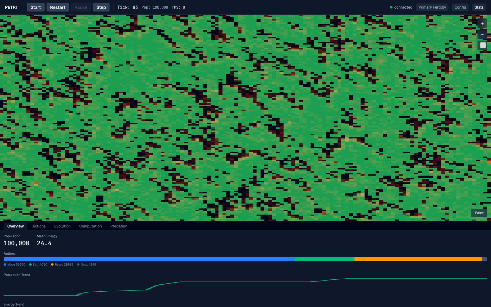

# Petri

Petri is a full-stack artificial-life and evolutionary simulation: mutable
multi-node controllers act in a live spatial ecosystem, while a Rust service
and React dashboard make applied state explorable. It demonstrates systems
engineering across simulation, typed APIs, real-time visualization, and
reproducible verification.



The screenshot was captured from a real initialized simulation; see its
[capture provenance](docs/assets/README.md).

## Technical highlights

- Build a seeded world, then start, pause, restart, and single-step its real
  lifecycle through a typed server boundary.
- Inspect live spatial views, telemetry, statistics, and individual creatures
  without detaching the dashboard from simulation-applied state.
- Paint the world, examine food fertility, and vary startup or runtime
  configuration to compare ecological conditions.
- Work through a Rust V3 simulation workspace, WebSocket world-view updates,
  and a TypeScript/React dashboard with focused unit and browser coverage.

## Explore the simulation

1. Start the local application and open the dashboard.
2. Set a seed in **Config**, then use **Restart** to create that simulation.
3. Use **Start**, **Pause**, and **Step** to control its lifecycle.
4. Paint cells or toggle the **Primary Fertility** overlay to explore spatial
   conditions, then open **Stats** for live population and behavior signals.
5. Select a creature in the world for its inspector details.

## Architecture at a glance

```text
React + TypeScript dashboard
  ├─ REST lifecycle and configuration commands
  └─ WebSocket world-view subscription
               │
               ▼
          v3-server
               │
               ▼
       v3-core simulation kernel
```

The current workspace members live under [`crates/`](crates/); the canonical
strategy and reference material live under [`docs/`](docs/README.md).

## Quick start

Prerequisites:

- Rust `1.93.0` (pinned in [`rust-toolchain.toml`](rust-toolchain.toml))
- Node.js `24.20.0` LTS (pinned in [`.nvmrc`](.nvmrc))
- npm from that Node installation

From the repository root:

```bash
nvm install
nvm use
npm --prefix frontend ci
./scripts/dev.sh
```

Open <http://localhost:5173>. For a release-mode local stack, run
`MODE=release ./scripts/dev.sh`.

## Verification

Run the repository checks from the root:

```bash
scripts/check-doc-harness.sh --mode strict
scripts/check-architecture-harness.sh --mode strict
scripts/check-plan-harness.sh --mode strict
scripts/security/test-gitleaks-scan.sh
scripts/security/test-skillspector-scan.sh
cargo fmt --all -- --check
cargo test --workspace
cargo clippy --workspace --all-targets -- -D warnings
npm --prefix frontend ci
npm --prefix frontend run lint
npm --prefix frontend run test
npm --prefix frontend run build
```

For the local browser suite, run:

```bash
cd frontend && npm run test:e2e
```

The ordinary CI workflow runs both deterministic security-wrapper/tooling
harnesses. The actual full-history Gitleaks scan and real SkillSpector scan
remain explicit local evidence operations; the current SkillSpector scan is
expected to return nonzero, as its linked documentation explains.

For defense-in-depth local auditing of repository skills, first bootstrap the
pinned scanner image once, then run its networkless scan:

```bash
scripts/security/skillspector-scan.sh --bootstrap
scripts/security/skillspector-scan.sh
```

SkillSpector is a local audit, not a clean-attestation claim. Its private
evidence and fail-closed policy are described in
[docs/security/skillspector-scan.md](docs/security/skillspector-scan.md).

## Documentation and policies

- [Documentation entrypoint](docs/README.md)
- [Strategy](docs/strategy/)
- [Reference specifications](docs/reference/)
- [Contributing](CONTRIBUTING.md)
- [Security policy](SECURITY.md)
- [License](LICENSE)

Compatibility notes for older top-level documents remain in the docs entrypoint.

## Active project status

Petri V3 is active engineering work. Its simulation behavior, server contract,
and dashboard continue to evolve alongside focused tests and evidence; this is
an explorable systems project rather than a frozen release.
