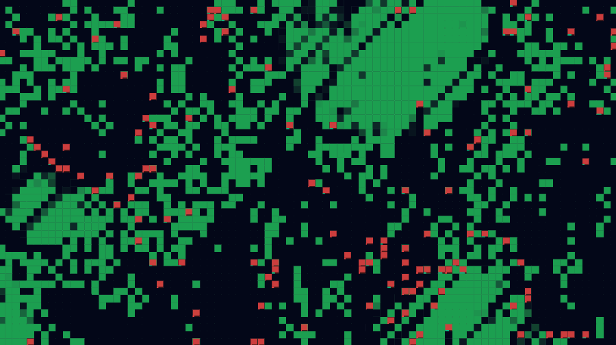

# Petri

Petri is a Rust and React artificial-life simulation with mutable controllers,
a live spatial ecosystem, and a dashboard backed by applied simulation state.

## Quick start

Required versions are Aqua >= 2.60.1, uv 0.12.3, Rust 1.93.0, Node 24.20.0,
and npm 11.19.0. Run `make setup`, then `make run`. Open
<http://localhost:5173>.

## Verification

Run `make check` before completing work. `make audit` performs the explicit
full-history secret scan. `make rust-check` runs format validation, the explicit
viability merge gate, `make rust-test-all`, and Clippy; `rust-test-all` runs the
complete named Rust test set. CI fans those named test targets out in parallel.
Run `make help` to see the individual local targets.

## Documentation

- [Documentation index](docs/README.md)
- [Contributing](CONTRIBUTING.md)
- [Security](SECURITY.md)
- [Changelog](CHANGELOG.md)
