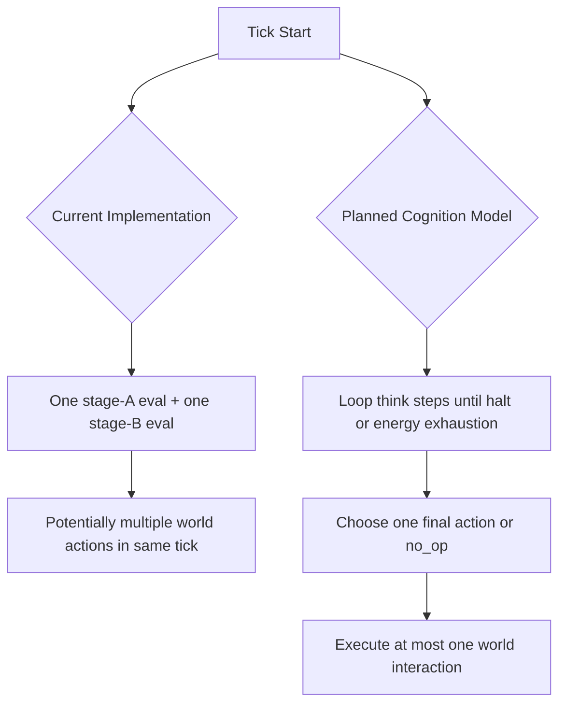

# Petri — Architecture Design Document

## Purpose

This document defines:
- the architecture that exists today in the repository
- the planned cognition-first refactor direction

It intentionally separates **Current Implementation** from **Planned Model** to avoid spec drift.

**Goal IDs:** `GP-01`, `GP-02`, `GP-03`, `GP-04`

## Goal Alignment

- `GP-01`: Keeps architecture choices test-oriented; deterministic mechanics are justified where they improve verification quality.
- `GP-02`: Documents crate boundaries and dependency ownership to prevent cross-layer coupling drift.
- `GP-03`: Keeps architecture decisions aligned with high-confidence iteration and safe refactoring.
- `GP-04`: Defines observability expectations for inspector and diagnostics behavior.

## Boundary Impact

- Crate direction remains `petri-graph -> petri-core -> petri-server/petri-cli`.
- Simulation policy remains in `petri-core`; graph representation/evaluation remains in `petri-graph`.
- Transport/runtime payload concerns remain in `petri-server` and synchronized with `web`.
- Planned cognition semantics intentionally change controller and world boundaries but do not alter crate ownership.

## Existing Boundary Recheck

| area | decision | rationale |
| --- | --- | --- |
| `crates/petri-core` world/tick ownership | `keep` | Core should continue to own simulation lifecycle and arbitration policy. |
| `crates/petri-server` transport and wire contract ownership | `keep` | Protocol and runtime control concerns belong in server boundary, not core/graph crates. |
| `crates/petri-graph` controller representation/evaluation ownership | `keep` | Graph crate remains the right boundary for controller I/O surface evolution. |

## Open Questions

| question | decision | owner | status |
| --- | --- | --- | --- |
| Should cognition-loop diagnostics include every intermediate step payload? | Start with summary diagnostics in stable payloads; consider expanded traces later if needed. | `petri-server` maintainers | `resolved` |
| Is backward compatibility for old snapshots required through cognition refactor? | No compatibility guarantee; document semantic break and migration expectations explicitly. | Project maintainers | `resolved` |
| Can Slice 6/7 proceed before Slice 5.5 semantics stabilize? | No. Keep Slice 5.5 as an explicit prerequisite. | Roadmap owners | `resolved` |

## Repository Architecture (Current)

```
petri/
├── crates/
│   ├── petri-core/      # world state, tick loop, action resolution
│   ├── petri-graph/     # controller node types, evaluation, mutation helpers
│   ├── petri-server/    # REST + WebSocket runtime wrapper around petri-core
│   └── petri-cli/       # headless runner, ablation, benchmark tools
├── web/                 # React + TypeScript client
├── docs/
└── README.md
```

Key boundary rules:
- `petri-core` owns simulation policy.
- `petri-server` owns transport/runtime API concerns.
- `petri-graph` owns controller representation/evaluation/mutation mechanics.
- `petri-cli` is a consumer of `petri-core` for reproducible runs and diagnostics.

## Core Runtime Model (Current)

### World and Creature

- World grid stores food density and barrier occupancy.
- Creature state includes position, energy, controller graph, memory register, slots/inventory, lineage IDs, inspector/debug caches, and per-creature RNG.

### Tick Lifecycle (Current)

Per creature, the current tick flow is effectively:
1. age increment
2. energy charge (tick decay + compute-cost term)
3. controller stage A eval (memory address)
4. memory read
5. controller stage B eval (action outputs)
6. memory write
7. conditional action attempts for eat/move/inventory/reproduce
8. death check

Important current property:
- Multiple world interactions can happen in a single tick if multiple outputs exceed thresholds.

## Planned Cognition-First Model (Not Implemented Yet)

### Design Intent

Enable evolution of richer decision processes by separating internal deliberation from world interaction frequency.

### Planned Tick Semantics

Per creature, per tick:
1. Apply passive tick costs.
2. Run an internal think loop with repeated controller evaluations.
3. Each think step costs `energy_per_think_step`.
4. Think loop ends when either:
   - `halt` output is asserted, or
   - energy is exhausted.
5. After thinking ends, perform at most one world interaction:
   - `move`, `eat`, `reproduce`, `inventory_pickup`, `inventory_put`, or `no_op`.

### Planned Arbitration Rules

- Final-thought wins (only final step outputs decide).
- `move` confidence derives from vector magnitude `sqrt(move_x^2 + move_y^2)`.
- `no_op` is explicit and competes like other actions.
- Exact confidence ties are broken randomly via per-creature seeded RNG.

### Planned Introspection Inputs

Controller receives direct confidence introspection channels:
- previous-step confidence per action candidate
- running-max confidence per action candidate within the current tick

### Current/Planned Diagram



## Data Contracts and Observability

### Current

- Inspector surfaces last inputs/outputs and memory-head state.
- Diagnostics track moves/eats/reproductions/deaths and illegal-action counts.

### Planned

- Add cognition-loop diagnostics (think steps, halts, arbitration outcomes).
- Add final selected action/confidence visibility in inspector payloads.
- Keep deterministic replay expectations by deriving tie randomness from per-creature seeded RNG.

## Performance and Verification Posture

### Current

- Throughput benchmark exists (`stage1_benchmark`) with historical threshold use.

### Planned During Refactor

- Treat throughput as informational while semantics stabilize.
- Reintroduce stricter performance gates after cognition semantics are stable and profiled.

## Compatibility Stance for Planned Refactor

- Planned cognition refactor is a semantic breaking change.
- Backward compatibility for old snapshot/config assumptions is not guaranteed.
- Migration/recovery strategy is documentation-led and explicit, not implicit compatibility shims.
