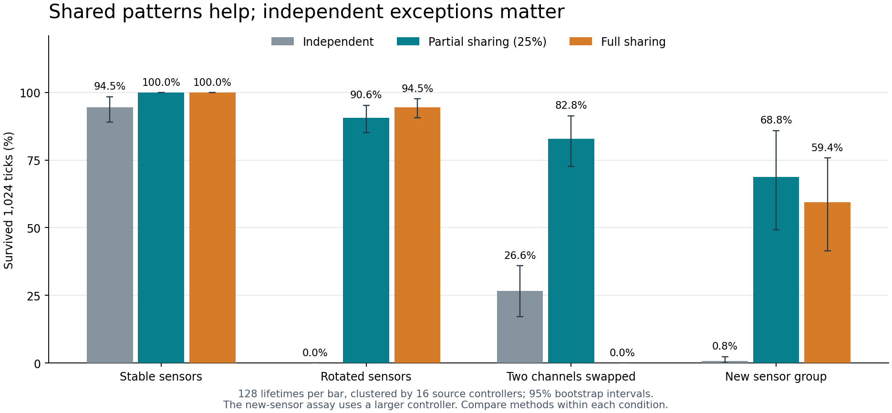

# Shared sensor learning: evidence for a roadmap direction

Date: 2026-09-23. Source: `aef05f9077efffdaf620c077a98a1f377b29bc3e`.
Status: four exploratory panels; a mechanism recommendation, not a production
feature specification or an ecological qualification result.

## Recommendation

**Prefer shared spatial patterns with independent exceptions.** Neutral group
connections provide access; coordinated variation and learning make that access
useful. Keep the degree of sharing adjustable rather than requiring all
directions to change identically.

Four further panels establish a useful boundary:

1. Shared learning resolves the previous probe's adaptation-speed failure.
2. Full sharing is brittle when the spatial relationship has exceptions.
3. Partial sharing makes an added neutral sensor useful while an established
   sensor remains functional.
4. Excessive exploration and sufficiently expensive learning erase viability.

The measured panels took **26.70 seconds after compilation**: 11,904 holdout
lifetimes and 3,584 training lifetimes. The effective independent source cohort
is **16 controllers**, not thousands of unrelated genotypes. These are authored
native-action assays with supplied food opportunities, not free-living ecology.

## What sharing means here

All controllers retain independently addressable weights. Each observed action
produces a prediction error against the food actually consumed. Independent
learning changes only that action's row of weights.

**Full sharing** transfers the same weight changes across corresponding
relative-direction pairs throughout the ring. For example, evidence about
food one position clockwise from an action also affects the corresponding
relationship for other actions. It shares changes, not the entire inherited
matrix: initial directional differences remain, and clamping can further
break equality.

**Partial sharing** sends 25% of each change across the ring and keeps 75%
specific to the chosen action. The chosen row receives the same total update
in all learners. This combines a shared pattern with directional exceptions.
The tested 25% is one useful experimental setting, not an established optimum.

The formula, spatial ordering, action credit and reward signal are supplied.
Evolution selects neither this formula nor the spatial correspondence in these
panels. This is not evidence that ordinary correlation-based Hebbian updates
will produce the same behavior.

## Experiment 1: can sharing make adaptation viable?

Each treatment starts from the same 16 previously evolved controllers and
receives matched birth jitter, food scenes and exploration. Rates are selected
on training episodes; the table uses eight new episodes per source controller.

| Lifetime learning | Stable | Sensor ring rotated mid-life | Rotated, then returned |
| --- | ---: | ---: | ---: |
| Off | 86/128 | 0/128 | 0/128 |
| Independent | 121/128 | 0/128 | 0/128 |
| Partial sharing | **128/128** | **116/128** | 76/128 |
| Full sharing | **128/128** | **121/128** | **106/128** |
| Wrong geometry, separately rate-selected | 86/128 | 0/128 | 0/128 |

Values are survivors to 1,024 ticks under normal native costs. Remapping occurs
after 128 two-tick trials; return occurs after another 128 trials.

Partial sharing improves rotated-condition survival over independent learning
by **90.6 percentage points**, paired 95% bootstrap interval **85.2–95.3**.
Stable survival improves by **5.5 points**, interval **1.6–10.9**. Both partial
and full sharing pass the predeclared preservation/adaptation screen.

Full sharing wins on this perfectly symmetric task, especially on return.
That advantage does not carry over to all geometries.

The wrong-geometry control transfers the same number of updates using an
incorrect ordering of motor directions. Fourteen of its 16 rate searches
select learning off. A later matched-rate control forces the same rate as the
full-sharing learner: **0/128 survive even stable conditions**. Useful spatial
correspondence matters; broadly transferring updates can be harmful.

## Experiment 2: what happens when directions have exceptions?

Use the selected rates without retraining. At mid-life, either swap two sensor
channels or apply a seeded arbitrary permutation. These mappings were absent
from training.

| Learner | Two channels swapped: survivors | Arbitrary permutation: survivors | Arbitrary permutation with energy support: final-period food capture |
| --- | ---: | ---: | ---: |
| Independent | 34/128 | 0/128 | 70.9% |
| Partial sharing | **106/128** | **10/128** | **80.4%** |
| Full sharing | 0/128 | 0/128 | 20.1% |

On the two-channel swap, partial sharing improves survival over full sharing
by **82.8 points**, interval **72.7–91.4**. Under the arbitrary permutation,
partial sharing is better than independent learning but still achieves only
**7.8% survival**. It has not solved rapid arbitrary remapping.

The supported diagnostic resets energy to 50 before every trial after the
change. Its final-period metric covers the last 128 trials. All these supported
episodes survive; their survival says nothing about real viability. The
diagnostic shows that independent exceptions can eventually compensate for a
bad shared assumption, whereas full sharing remains constrained.

## Experiment 3: can an added neutral sensor become useful?

A newborn inherits the competent old food-ring controller and receives a
second food ring with **64 initially zero weights**. The old matrix is frozen;
only the new matrix learns. The graph supplies a reflex for eating either food
type and gives the old nutritious food priority if both types occupy a cell.
Every treatment, including learning-off, has the same larger graph and cost.

In useful conditions, 75% of trials offer old food and 25% offer only the new
food. The old sensor retains its original meaning. New food has the same
nutritional value, and the new ring's indexing is either aligned or rotated.

| New-ring learning | Survivors | Old food captured | New food captured |
| --- | ---: | ---: | ---: |
| Off | 0/128 | 28.4% | 6.1% |
| Independent | 1/128 | 33.5% | 11.6% |
| Partial sharing | **88/128** | **69.7%** | **68.8%** |
| Full sharing | 76/128 | 64.4% | 59.4% |
| Wrong geometry | 0/128 | 30.6% | 9.2% |

Food fractions use all scheduled opportunities, including periods after death.
They therefore measure persistence as well as decisions. The rise in old-food
capture reflects longer survival; the old weights were not improved here.
Do not compare these survival counts directly with the smaller controllers in
experiment 1.

Partial versus independent learning gains **68.0 survival points**, interval
**48.4–85.2**. Among the 88 partial-sharing survivors, every new ring responds
correctly to **all eight isolated food directions** in a fresh greedy probe.
Zeroing the learned new weights reduces that to **one of eight**. This is a
direct test of functional use of the new connections, beyond incidental food
collection. It does not establish richer scene generalization.

Aligned and rotated cases have identical outcomes here. With zero new weights
and this symmetric setup, rotating channel labels preserves the learning
trajectory up to relabeling. They are not two independent confirmations.

### Irrelevant-input control

The second food field is sampled independently and supplies **zero nutritional
energy**. The original food remains available on every trial. This field can
distract movement or waste an eating action; it contains no designed cue to
the nutritious field.

Partial sharing yields **91/128 survivors**, versus **92/128** with the new
weights frozen. The paired difference is **−0.8 points**, interval **−2.3–0.0**.
Nutritious food capture falls from **70.8% to 70.4%**, a small measurable cost.
Independent and full sharing yield 84/128 and 85/128 survivors respectively.

This supports tolerance of this particular irrelevant input, not perfect
immunity to distraction. Rates were selected on a mixture of useful and
irrelevant training episodes; robustness to noise was part of the training
objective. These learners choose much smaller rates than the remapping panel.

## Experiment 4: dependence on exploration and learning cost

These are post-result sensitivity checks using the selected controllers and
rates, with fresh episode seeds and no further tuning.

### Exploration

| Random exploratory moves | Independent: rotated survival | Partial sharing: rotated survival | Full sharing: rotated survival |
| --- | ---: | ---: | ---: |
| 0% | 0/128 | 122/128 | 122/128 |
| 5% | 0/128 | **125/128** | 124/128 |
| 20% | 1/128 | 118/128 | 121/128 |
| 40% | 0/128 | 0/128 | 0/128 |

Sharing's benefit does not require the supplied 20% exploration rate in this
assay. In stable conditions, zero exploration gives the sharing learners
99.9% food capture and full survival. At 40% exploration, even stable-condition
survival falls to zero for all three learners. The fixed 20% rate was a probe
choice, not a recommended production default.

Zero forced exploration does not mean zero behavioral variation: scenes,
birth jitter, inherited differences and ongoing weight changes still vary
what is tried. The small 5%-versus-0% survival difference does not establish
an optimal exploration rate.

### Cost of updating materialized weights

The reference learner's own work is uncharged in the preceding panels. This
sensitivity test debits energy after learning, per attempted weight update;
shared methods attempt 64 updates per trial, including zero-delta entries.

| Extra energy per attempted update | Partial sharing: rotated survival | Full sharing: rotated survival |
| --- | ---: | ---: |
| 0 | 118/128 | 121/128 |
| 0.0001 | 118/128 | 121/128 |
| 0.001 | 107/128 | 118/128 |
| 0.01 | 0/128 | 0/128 |

At 0.01 per update, the extra cost is 0.64 energy per completed learning step;
stable-condition survival also falls to zero. These are deliberately imposed
research costs, **not measured implementation costs**. Charges are limited to
available energy and exhaustion removes the creature. Native metabolism,
carrying, computation and actions remain charged as before.

A representation storing a shared pattern plus residuals could incur different
costs from rewriting a 64-weight matrix. This test sets a sensitivity boundary;
it does not choose the representation, price, or VM instruction budget.

## What this supports, and what remains open

The [ALife literature review](alife-sensorimotor-learning-research-2026-09-23.md)
provided precedents for grouped projections, spatial reuse, evolved initial
behavior, and lifetime learning. The local experiments now distinguish
credible options:

| Option | Evidence and tradeoff |
| --- | --- |
| Neutral group connections alone | Provide access; the frozen new-ring control remains mostly unused. Access is insufficient by itself. |
| Independent action-specific learning | Flexible, but too sample-hungry in these survival-limited tests. |
| Full spatial sharing | Fast and effective when the geometry is valid; brittle when directions have exceptions. |
| Partial sharing plus independent changes | Best balance across this suite; supplies a spatial assumption and still has limits under arbitrary mappings. |
| Coordinated genetic variation | Remains supported by the earlier wiring and learning panels; useful starting behavior complements lifetime adaptation. |

**There is enough evidence to scope a roadmap direction:** group-aware
sensorimotor coordination, with neutral access, shared patterns, independent
exceptions, and qualified lifetime adaptation. There is not enough evidence
to fix a universal sharing strength, remove edge deletion, connect every input
to every output permanently, or replace native learning with this formula.

Before implementation commitments, resolve three boundaries:

1. **Graph and VM representation and real costs.** The present learner changes
   graph weights from the harness. VM parity, mutation reachability, instruction
   budgets, and intrinsic action-credit delivery remain untested here.
2. **Ecological transfer.** Validate without recentering, scripted food offers,
   the supplied eating reflex, or an externally supplied reward/credit update.
   Natural lifetime opportunities and reproduction may change the result.
3. **Which quantities evolve.** Candidate choices include the shared pattern,
   independent residuals, learning rate and sharing strength. The current suite
   tests supplied formulas and a tiny rate search; it does not show that
   production mutation can discover the machinery or an optimal mix.

Existing ownership spans T11 representation/variation, T13 neutral recruitment,
and T09 cognition/learning. A future track should coordinate those contracts
through the existing workflow. No roadmap IDs or features are added here.

## Design, uncertainty, and reproduction

All panels reuse the 16 coordinated/stable controllers from the earlier
restricted evolutionary search, retaining weaker controllers. Each comparison
uses eight paired holdout episodes per controller. Birth jitter and food scenes
are matched within a panel. Main rate searches evaluate seven candidates on
four training lifetimes, choosing ticks survived, then food, then smaller rate.
Only learning rate is selected; no new starting weights are evolved.

Normal lifetimes start at 20 energy and last up to 512 two-tick trials.
The harness executes native movement, eating, sensing, energy and death checks.
Food and creature position are reset each trial; growth, reproduction and
competition are absent. Old weights are frozen only in the recruitment panel.
Groups have eight sensor directions and eight movement directions: 64 weights
per group. All lifecycle state resets between lifetimes.

Food metrics include zeros after death. Paired intervals resample the 16 source
controller blocks with 10,000 bootstrap draws. They are exploratory and not
adjusted for multiple comparisons. Zero observed survival is not proof of a
zero population success probability. Supported diagnostics and sensitivity
analyses are labeled separately from normal-cost primary outcomes.

Primary and geometry protocols were written before their runs. Recruitment
was specified before its run; robustness was specified after the first two
panels and before its run. Fresh episode seeds do not make these independent
replications of the source-controller search. The narrow architecture and
supplied geometry limit generalization.

Panel durations after compilation: primary 5.524s, geometry 4.349s,
recruitment 7.469s, sensitivity 9.358s. These describe compute expenditure,
not comparative backend performance.

**Verification:** 18 probe tests pass, including seven property tests. Checks
cover the selected-row update, transfer geometry, neutral sensor addition,
native food-type selection, mid-life remapping, and applied research charges.
Two complete seed blocks replayed: **40 tuning/result rows match exactly**,
with only a subsequently added explicit zero-cost field normalized for the
historical primary records. Documentation uses `make check-docs`.

- [Summary, paired intervals, protocols and complete source](ring-group-experiments-2026-09-23.results.json)
- [Complete raw observations: gzip-compressed JSON](ring-group-experiments-2026-09-23.observations.json.gz)
- [Figure](ring-group-experiments-2026-09-23.png)

The working probe is `.bench-artifacts/ring-group-2026-09-23/`. Reproduce with
`sh .bench-artifacts/ring-group-2026-09-23/reproduce.sh`. To reconstruct elsewhere,
restore each `source_snapshot` entry's `text` under that directory on the
recorded repository revision. The experiment and analysis need Rust and Python's
standard library; rendering the optional figure additionally needs Matplotlib.
The artifact includes lockfile, source hashes, raw-file hashes and regression
seeds. Production source, defaults, roadmap files and Git history are unchanged.
