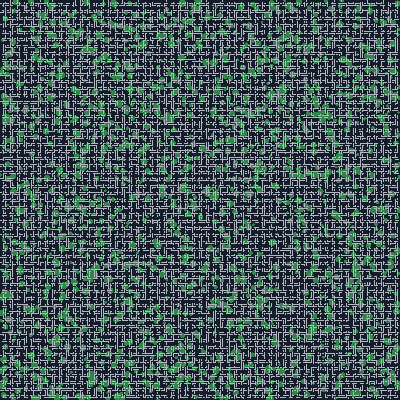
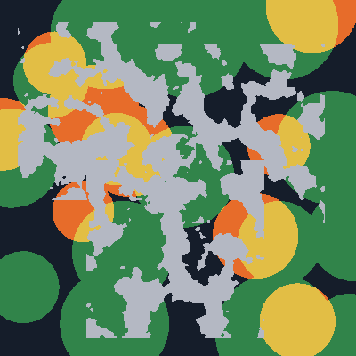

# Baseline worlds

`make bench PROFILE=goal FEATURE=<feature-slug>` runs three environments once
each: Orchards in grassland / 11, Canyon country / 22, and Confluence / 33.
Each runs for 2,000 ticks with production founder, energy, mutation and runtime
policies. Reports belong to `goal-worlds-v1`; historical `goal-v1` reports are
separate controls, with no cross-profile delta. `plains.json` is `{}` and stays
loadable as an optional production-default control, not a fourth goal run.

All recipes start at 1600 × 1600 and omit the map seed: map and layer generation
follow each case's run seed, while the existing run RNG handles food/founders.
The files contain environmental differences only. Load any file with the app's
Load Recipe control or `cargo run --release -p v3-cli -- run --config <path>`.
An explicitly requested generic sweep can still use `make bench PROFILE=sweep
BENCH_ARGS="--config experiments/worlds/confluence.json --seeds 33 --ticks 2000"
OUT=<report-path>`; it is not additional required closure work.

| Recipe | Pressure | Applied tick-zero reading |
| --- | --- | --- |
| Plains | Default barrier-free world | Historical goal-v1 control; no new mandatory reading |
| Orchards in grassland | Fruit pays 12 energy/density versus grass 5, covers 20% of eligible fruit habitat versus grass 54% of passable cells, grows at 0.025 versus 0.09, recovers at 0.002 versus 0.01 attempts/cell/tick | 100% passable; all passable cells connected; fruit initially covers 185,424 / 2,560,000 world cells (7.24%) |
| Canyon country | Maze with corridor width 5 and wall thickness 2; production food substrate | 71.409% passable; all passable cells connected |
| Confluence | Bounded edges, three overlapping fBm terrain regions, large zero-minimum fertility blobs, differentiated foods | 74.047% passable; largest component contains 99.879% of passable cells; fruit initially covers 103,211 / 2,560,000 world cells (4.03%) |

Coverage is a fraction of eligible cells, not achieved whole-world coverage.
Fruit's `initial_fertility_only` uses strictly positive effective tick-zero
fertility; zero minimum and disabled annealing make the large blobs real initial
patches. Grass shares some fruit habitat and extends beyond it. Orchards has
788,036 overlapping habitat cells, 1,034,185 grass-only and 139,084 fruit-only.
Confluence has 380,250 overlapping passable habitat cells, 953,356 grass-only
and 135,803 fruit-only; 489,858 barrier cells overlap potential food habitat.
Its terrain cuts across these habitats, producing narrow routes and small
isolated pockets rather than requiring every cell connected.

The previews sample the applied tick-zero grid every four cells: gray barriers,
green grass habitat, orange fruit habitat, yellow overlap, dark neither habitat.
They show potential positive-fertility habitat, not food density or occupancy.

Regenerate the full-size layout observations and preview PPM files with
`cargo test -p v3-core --test baseline_worlds inspect_saved_world_layouts --
--ignored --nocapture`. Connectivity uses eight-direction movement with the
world's actual edge rule, ignores occupancy, and is measured before tick work.

Persistence and full goal readings are pending the single final goal run.
Survival through 2,000 ticks is not proof of long-term viability, evolved food
specialization, or causal necessity of barrier awareness. This first series
reading precedes the planned T11 supply repairs; later matching readings name
that substrate change rather than attributing it to the worlds.
